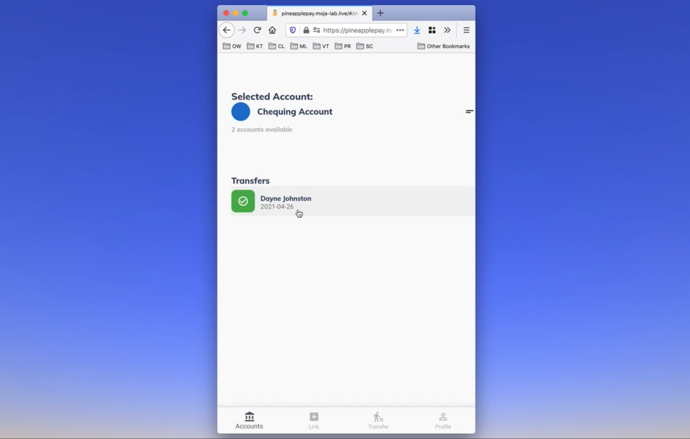

# contrib-pisp-demo-ui
### A reference end-user application for PISP on Mojaloop. Inspired by GPay.




__See it live at: https://pineapplepay.moja-lab.live/#/dashboard__

## Introduction

[contrib-pisp-demo-ui](https://github.com/mojaloop/contrib-pisp-demo-ui) was developed to demonstrate the ability of Mojaloop to make end to end transfers. It's a payment initiation app, which allows people to send money to one another. The basic features of the app are:

1. Login/Authentication
2. Account Linking
3. Dashboard
4. Third Party Initiated Transfers


**For more information about Mojaloop and PISP with Mojaloop, see:**
- [mojaloop/pisp](https://github.com/mojaloop/pisp)
- [mojaloop/mojaloop](https://github.com/mojaloop/mojaloop)
- [mojaloop.io](https://mojaloop.io/)


## Demo

- See it live at: https://pineapplepay.moja-lab.live/#/dashboard
- View a video introduction [here](https://mojaloopcommunitymeeting.us2.pathable.com/pisp-demo-pi-14#/?limit=10&sortByFields[0]=createdAt&sortByOrders[0]=-1&uid=Dg6xvE5DuqnbJpKwn)


## Docs

Full documentation can be found [here](docs/)

- The linking sequence diagrams are [here](https://github.com/mojaloop/pisp-demo-server/tree/master/docs/assets/diagrams/transfer)


## Developing Locally

This project is written in Dart, and uses Google's Cross-platform Flutter library.


### Android

1. Clone [this](https://github.com/mojaloop/pisp-demo-app-flutter) repository.
2. [Install](https://flutter.dev/docs/get-started/install) the flutter sdk.
3. [Install](https://developer.android.com/studio/install) Android Studio.
4. Install flutter and dart plugin on android studio. Go to `File->Settings->Plugins` (Windows) or `Android Studio -> Preferences->Plugins(Mac)` and install the flutter plugin.
5. Clone the repository and open the **root directory** from Android Studio
6. Go to `Settings -> Flutter` (Windows) `Android Studio -> Preferences -> Languages & Frameworks -> Flutter` (Mac)  and add the path to flutter SDK if not already present.
7. Get your google-services.json from firebase. Follow the steps [here](https://www.digitalocean.com/community/tutorials/flutter-firebase-setup) This is necessary to build the app successfully.
8. Connect device/ emulator and run the app.


```bash
keytool -list -v -keystore ~/.android/debug.keystore -alias androiddebugkey -storepass android -keypass android
```


9. Make sure you enter the app's SHA-1 fingerprint under the [Settings page](https://console.firebase.google.com/u/0/project/_/settings/general) of your Firebase console as this is required to ensure that Google sign-in functions properly. You can get the app's debug SHA-1 fingerprint by running this command: `keytool -list -v -alias androiddebugkey -keystore %USERPROFILE%\.android\debug.keystore`.
10. Connect device/ emulator and run the app.


### Web

1. Make sure you have flutter web enabled. See [this guide](https://flutter.dev/docs/get-started/web) for steps
2. Ensure that `flutter devices` outputs the following:

```
1 connected device:

Chrome (web) • chrome • web-javascript • Google Chrome 88.0.4324.182
```

```bash
git clone git@github.com:mojaloop/pisp-demo-app-flutter.git
cd pisp-demo-app-flutter
flutter run -d chrome --web-port 5000
```

## Deploying 

> Note: We only deploy the _web_ version of this project at the moment.

First, we need to set up firebase (only once)
```bash
# release to the firebase project
npm install -g firebase-tools
firebase login
firebase init

# select the following options:
# - existing project
# - mojapay-dev
# - build/web
# - rewrite - Yes
# - automatic builds - No
# - overwrite web/index.html - No
```

```bash
# Then, make sure we have the correct fido2_client
cd ..
git clone https://github.com/mojaloop/fido2-client-plugin fido2_client

cd pisp_demo_app_flutter
flutter build web
firebase deploy
```

Now go to https://mojapay-dev.web.app to see it live!

## JSON Serialization

To generate the files that handle JSON encoding/decoding for model objects (e.g. consent.g.dart), run `flutter pub run build_runner build` in the project directory.
   
## Flutter handy snippets

```bash
# upgrade dependencies
flutter pub upgrade

# rebuild generated files
flutter pub run build_runner build --delete-conflicting-outputs

# specify a flutter version to use
flutter version v1.9.1+hotfix.3
```
