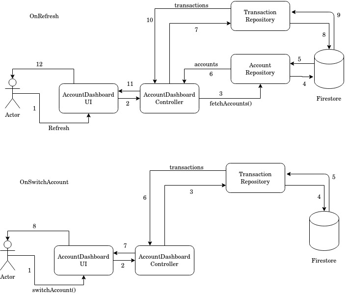

# Account Dashboard

Page to view information about all the accounts the user has linked and the transaction he/she has made from them.

Components of the app this feature depends on:
   

### Controllers

1. AuthController
2. AccountController
3. AccountDashboardController

### Repositories

1. AccountRepository 
2. TransactionRepository 

### UI Pages

1. AccountDashboard

## Business Logic

We have two events that the user can trigger here.

### Refresh

On scrolling down all the way, the user can trigger a refresh. The steps which follow are as follows:

1. The refresh event is picked up by the AccountDashboard page.
2. The AccountDashboardController is notified of the refresh event.
3. AccountDashboardController asks AccountRepository to fetch all linked accounts of logged in user.
4. AccountRepository queries firestore.
5. Firestore responds with a list of accounts.
6. The accounts are passed back to AccountDashboardController.
7. The AccountDashboardController chooses the first account as selectedAccount and tries to fetch its transactions from TransactionRepository.
8. TransactionRepository queries firestore.
9. Firestore responds with a list of transactions for selectedAccount.
10. transactions passed to AccountDashboardController. 
11. AccountDashboardController updates ui with new transactions. 
12. UI rendered.

### Switch Account

The user can switch the account whose information they want to see. The flow is same as that of `onRefresh` above. Just that instead of fetching all accounts first, we directly try to fetch transactions for the selectedAccount. The diagram clearly describes it.